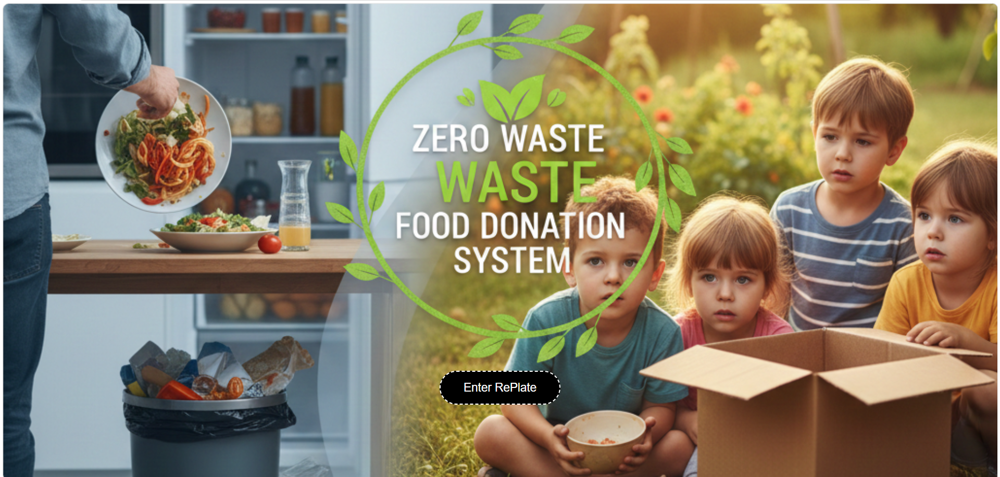
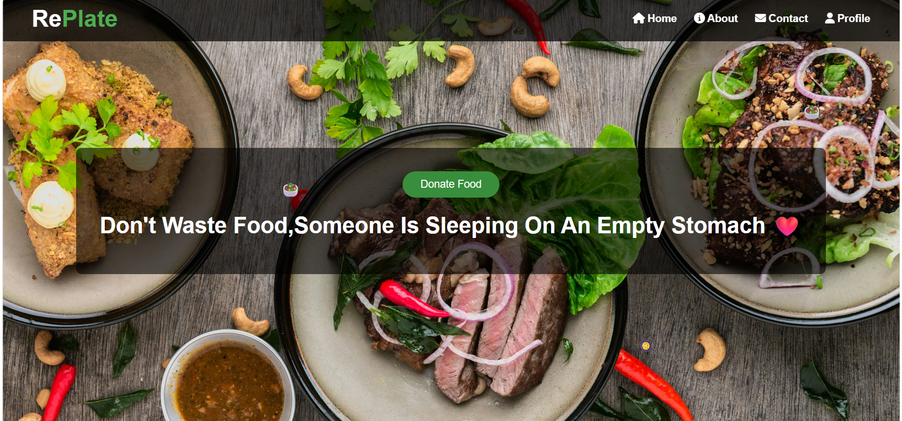
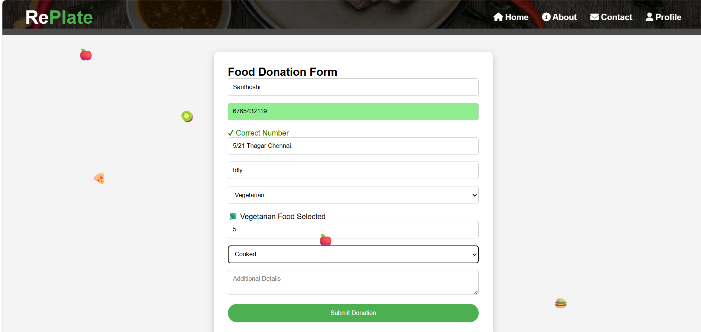
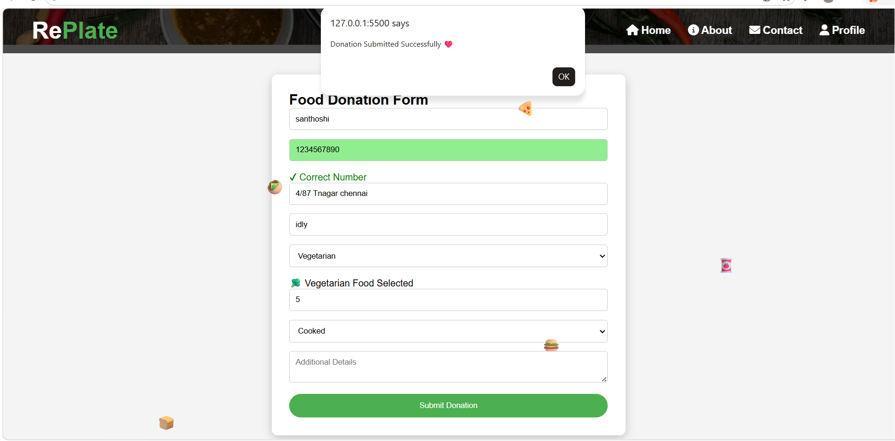
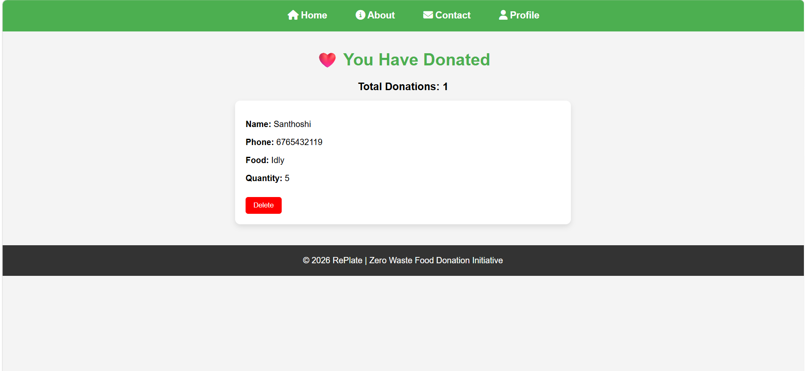

# 🍽 RePlate – Zero Waste Food Donation System
 - RePlate is a web-based platform designed to reduce food waste and help feed people in need. The system encourages individuals, restaurants, and organizations to donate surplus food instead of throwing it away.
- The goal of this project is to connect food donors with people who need food, helping reduce hunger while minimizing food waste.
## 📖 Introduction
- Food waste is a serious global problem while millions of people still suffer from hunger every day.
- RePlate aims to bridge this gap by creating a platform where surplus food can be donated and distributed to those who need it.
 The platform spreads awareness about responsible food usage with the message:
"Don't waste food when someone is hungry."
## 📌 Project Description
   🎯 The Zero Waste Food Donation System allows users to:
  - Donate surplus food.
  - Raise awareness about food waste.
  - Support people facing hunger.
  - Encourage responsible food management.
  - The website begins with an interactive intro page that shows the reality of food waste and hunger before allowing users to enter the main platform.
## ✨ Features
 - Intro Awareness Page – Shows message about food waste.
 - Scratch-style introduction concept (interactive idea).
 - Motivational quotes about food donation.
 - Clean and simple homepage.
 - Food donation awareness platform.
 - Responsive design.
## 🖥 Technologies Used
- HTML5
- CSS3
- JavaScript
- Responsive Web Design
- LocalStorage

## 🚀 How to Run the Project

1️⃣ Download or Clone the Repository
Copy code

- git clone https://github.com/santhoshi-dotcom/Frontend-project.git
2️⃣ Open the Project Folder
Copy code

 - Frontend-project
3️⃣ Run the Project
Simply open:
Copy code

 - intro.html in your browser.
   
## 📂 Project Structure
Copy code

RePlate
│
├── intro.html
├── index.html
├── style.css
├── script.js
|__ about.html
|__ contact.html
|__ profile.html
├── images
│   └── intro.jpg
|   └── home.jpg
|   └── donateform.jpg
|   └── alert.jpg
|   └── profile.jpg
│
└── README.md

# 🖼 Application Flow

## 1.Intro Awareness Page - Shows message about food waste.
 
## 2.Homepage with motivational quotes about food donation.
 
## 3.User clicks the donation form and fills the form.

## 4.User submits the form.

## 5.Data is stored in using local storage in profilepage.

## 🌍 Purpose of the Project

 🎯The main aim of this project is to:

- Reduce food waste
- Help hungry people
- Spread awareness about food donation
- Promote social responsibility

## 📌 Future Improvements
- User login system
- Donor registration-
- Food request system
- NGO / volunteer integration
- Location-based food pickup
- Database integration

## 👩‍💻 About the Project

Project Name: RePlate – Zero Waste Food Donation System.
Type: Web Application.
Purpose: Reduce food waste and support people in need.
Publisher:Santhoshi G

# # ❤️ Message

🎯“Food is meant to be shared, not wasted.”
